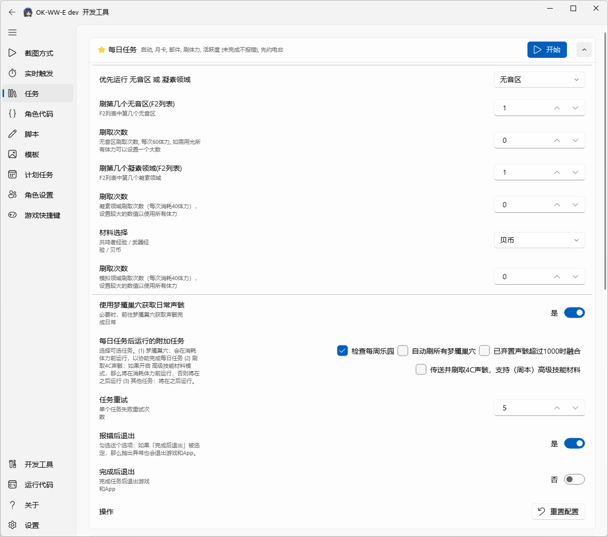

# ok-ww enhanced

English | [中文](README.md) | [日本語](README_ja.md)

### Introduction

Based on the [original ok-ww](https://github.com/ok-oldking/ok-wuthering-waves), this version keeps all original features and **adds a new daily all-in-one task, improves task robustness and log readability, and makes unattended operation and debugging easier.**

Code changes: https://github.com/zzc-tongji/ok-ww-enhanced/compare/master..main?diff=split .

Build method changes: [build.diff.html](https://htmlpreview.github.io/?https://raw.githubusercontent.com/zzc-tongji/ok-ww-enhanced/refs/heads/main/readme/build.diff.html) .

### New Features

All new features are marked with ⭐.




#### New Stamina Tasks (Tacet Field, Forgery Challenge, Simulation Challenge)

- Supports setting the number of runs:
  - Set it to 0 if you do not need to run the task. Set it to a large number if you want to use all stamina.
  - The run count is calculated by 1x (minimum) stamina. 2x stamina runs are supported, and the corresponding run count is counted as 2.
  - This is implemented by injecting the use_stamina function. Here is the comparison before and after injection: [use_stamina.diff.html](https://htmlpreview.github.io/?https://raw.githubusercontent.com/zzc-tongji/ok-ww-enhanced/refs/heads/main/readme/use_stamina.diff.html) .

#### New Daily All-in-One Task

- Uses the new stamina tasks (Tacet Field, Forgery Challenge, Simulation Challenge). Each stamina task can have its own run count, including skipping runs or using all stamina.
- Supports setting retry counts, applied separately to each task. If a task still cannot be completed after all retries are used, a log entry is recorded and a **screenshot** is taken.
- Optimized log file `./logs/ok-script.log`:
  - If some tasks cannot be completed, it contains the text `未完成` for later processing, such as sending notifications.
  - If an exception occurs, it contains the text `一条龙错误` and the error stack for later processing.
- Changes in the new [DailyTask2.py](./src/task/DailyTask2.py) compared with the original [DailyTask.py](./src/task/DailyTask.py):
  - Compared with the original version, the new version adds task retries, exception logs, and exception screenshots.
  - When an exception occurs, the new version can be configured to exit the program, while the original version does not exit.
  - Code change report: [DailyTask.diff.html](https://htmlpreview.github.io/?https://raw.githubusercontent.com/zzc-tongji/ok-ww-enhanced/refs/heads/main/readme/DailyTask.diff.html) .

### How to Run

#### Run with GUI

Download the latest `ok-ww-e-win32-Global-setup.exe` from [Release](https://github.com/zzc-tongji/ok-wuthering-waves-enhanced/releases), then double-click it to install.

#### Run with CLI

Download the latest `ok-ww-e-win32-Global-setup.exe` from [Release](https://github.com/zzc-tongji/ok-wuthering-waves-enhanced/releases), then double-click it to install.

```pwsh
cd "<ok-ww-e-installation-directory>\data\apps\ok-ww-e\working"

# Automatically run task 1 (new daily all-in-one task) after startup, then exit the program after the task is completed.
ok-ww-e.exe -t 1 -e

# Automatically run task 5 (original daily all-in-one task) after startup, then exit the program after the task is completed.
ok-ww-e.exe -t 5 -e
```

*   `-t` or `--task` - Automatically run the Nth task after startup.
*   `1` - The first task in the task list ([config.py -> onetime_tasks](https://github.com/zzc-tongji/ok-wuthering-waves-enhanced/blob/main/config.py#L165)).
*   `-e` or `--exit` - Automatically exit the program after the task is completed.

#### Run from Source

It is recommended to install dependencies into a [miniconda](https://www.anaconda.com/docs/getting-started/miniconda/main) virtual environment.

``` powershell
# requirement
conda create --name okww python=3.12 pip=25.0
pip install -r requirements.txt --upgrade
pip install -r requirements-dev.txt --upgrade

# release
python main.py

# debug
python main_debug.py
```

#### Develop and Debug with VSCode

https://github-com.translate.goog/ok-oldking/ok-wuthering-waves/discussions/934?_x_tr_sl=zh-CN&_x_tr_tl=en

#### COCO Feature Preview

Image features in `assets/coco_annotations.json` can be previewed at the link below (continuously updated):

https://htmlpreview.github.io/?https://raw.githubusercontent.com/zzc-tongji/ok-ww-e-coco-preview/refs/heads/main/data/index.html

### Tips

- ok-ww-e can restart the game after a game hot update, but you need to disable `Settings / Basic Settings / Automatically exit the application when the game exits`.
- If ok-ww-e cannot start the game, first try starting it as administrator. If that does not work, start `cmd /c start "" ok-ww-e.exe` from an administrator cmd command line.

### Disclaimer

This software is an external tool designed to automate Wuthering Waves gameplay. It interacts with the game only through the existing user interface and complies with relevant laws and regulations. This software package is designed to simplify user interaction with the game. It does not disrupt game balance, provide an unfair advantage, or modify any game files or code.

This software is open-source and free, intended only for personal learning and communication, and limited to personal game accounts. It must not be used for any commercial or profit-making purpose. The development team reserves the final right of interpretation for this project. Any issues caused by using this software are unrelated to this project and its development team. If you find merchants using this software for paid account boosting, that is the merchant's personal behavior. This software does not authorize use for account boosting services, and any resulting issues and consequences are unrelated to this software. This software does not authorize anyone to sell it. Sold copies may contain malicious code that can cause game accounts or computer data to be stolen, which is unrelated to this software.

Please note, according to Kuro's Fair Play Declaration for Wuthering Waves:

```
The use of any third-party tools to disrupt the game experience is strictly prohibited.
We will strictly crack down on the use of prohibited tools such as plugins, accelerators, cheat software, and macro scripts. These actions include, but are not limited to, automatic farming, skill acceleration, invincibility mode, teleportation, modification of game data, and other operations.
Once verified, we will take measures depending on the severity and number of violations, including but not limited to deducting illicit gains, freezing or permanently banning the game account.
```

------

# README of ok-ww

------

<div align="center">
  <h1 align="center">
    
    <br/>
    ok-ww
  </h1> 
  
  <p>
    An image-recognition-based automation tool for Wuthering Waves, with background mode support, developed with <a href="https://github.com/ok-oldking/ok-script">ok-script</a>.
  </p>
  
  <p><i>Operates by simulating the Windows user interface, with no memory reading or file modification.</i></p>
</div>

<!-- Badges -->
<div align="center">
  

[](https://github.com/ok-oldking/ok-wuthering-waves/releases)
[](https://github.com/ok-oldking/ok-wuthering-waves/releases)
[](https://discord.gg/vVyCatEBgA)

</div>

**Demo & Tutorial:** [](https://youtu.be/h6P1KWjdnB4)

---

## ⚠️ Disclaimer

This software is an external auxiliary tool designed to automate parts of the Wuthering Waves gameplay. It interacts with the game solely by simulating standard user interface actions, in compliance with relevant laws and regulations. This project aims to simplify repetitive user tasks and does not disrupt game balance or provide an unfair advantage. It will never modify any game files or data.

This software is open-source and free, intended for personal learning and communication purposes only. Do not use it for any commercial or profit-making activities. The development team reserves the right of final interpretation. Any issues arising from the use of this software are not the responsibility of this project or its developers.

Please note, according to Kuro Games' official Fair Play Declaration for Wuthering Waves:
> The use of any third-party tools to disrupt the game experience is strictly prohibited.
> We will take strict measures against the use of unauthorized tools such as cheats, speed hacks, cheat software, and macro scripts. This includes, but is not limited to, automated farming, skill acceleration, god mode, teleportation, and modification of game data.
> Once verified, we will impose penalties based on the severity and frequency of the violation, including but not limited to deducting illicit gains, and suspending or permanently banning the game account.

**By using this software, you acknowledge that you have read, understood, and agreed to the above statement, and you voluntarily assume all potential risks.**

## 🚀 Quick Start

1.  **Download the Installer**: From the "Downloads" section below, download the latest `ok-ww-win32-setup.exe` installer file.
2.  **Install the Program**: Double-click the `ok-ww-win32-setup.exe` file and follow the on-screen instructions to complete the installation.
3.  **Run the Program**: After installation, launch `ok-ww` from the desktop shortcut or the Start Menu.

## 📥 Downloads

*   **[GitHub](https://github.com/ok-oldking/ok-wuthering-waves/releases)**: Official release page, fast access worldwide. (**Please download the `setup.exe` installer, not the `Source Code` archive**).

## ✨ Main Features


*   **High-Resolution Support**: Runs smoothly on all 16:9 resolutions up to 4K (minimum 1600x900). Some features are also compatible with ultrawide resolutions like 21:9.
*   **Background Mode**: Supports running in the background while the game window is minimized or obscured, allowing you to use your computer for other tasks.
*   **Intelligent Recognition**: Automatically recognizes all characters, eliminating the need for manual skill sequence configuration. Start with a single click.
*   **Auto-Mute**: Can automatically mute the game audio when running in the background.

## 🔧 Troubleshooting

If you encounter issues, please check the following steps one by one before asking for help:

1.  **Installation Path**: Ensure the software is installed in a path containing **only English characters** (e.g., `D:\Games\ok-ww`). Do not install it in `C:\Program Files` or folders with non-English characters.
2.  **Antivirus Software**: Add the software's installation directory to the **exceptions or whitelist** of your antivirus software (including Windows Defender) to prevent files from being mistakenly deleted or blocked.
3.  **Display Settings**:
    *   Turn off all graphics card filters (like NVIDIA Game Filter) and sharpening features.
    *   Use the game's default brightness settings.
    *   Disable any overlays that display information on the game screen (e.g., frame rates from MSI Afterburner, Fraps, etc.).
4.  **Custom Keybinds**: If you have changed the default in-game keybinds, you must update them accordingly in the `ok-ww` settings. Only the keybinds listed in the settings are supported.
5.  **Software Version**: Check and ensure you are using the latest version of `ok-ww`.
6.  **Game Performance**: Make sure the game can run stably at **60 FPS**. If the frame rate is unstable, try lowering the game's graphics quality or resolution.
7.  **Game Disconnections**: If you frequently get disconnected from the server, try launching the game manually and playing for 5 minutes before starting the tool. If you get disconnected, simply log back in without closing the game.
8.  **Getting Help**: If the steps above do not solve your problem, please submit a detailed bug report through our community channels.

---

## 💻 Developer Zone

### Running from Source (Python)

This project only supports Python 3.12.

```bash
# Install or update dependencies
pip install -r requirements.txt --upgrade

# Run Release version
python main.py

# Run Debug version
python main_debug.py
```

### Command-Line Arguments

You can use command-line arguments for automated startup.

```bash
# Example: Automatically run the first task after launch and exit the program upon completion
ok-ww.exe -t 1 -e
```

*   `-t` or `--task`: Automatically runs the Nth task in the list after launch. `1` represents the first task.
*   `-e` or `--exit`: Automatically exits the program after the task is completed.

## 💬 Join Us

This project is developed based on the [ok-script](https://github.com/ok-oldking/ok-script) framework. The core code is only about 3000 lines (Python), making it simple and easy to maintain. Developers interested in creating their own automation projects are welcome to use [ok-script](https://github.com/ok-oldking/ok-script).

## 🔗 Projects using ok-script:

*   Wuthering Waves: [https://github.com/ok-oldking/ok-wuthering-waves](https://github.com/ok-oldking/ok-wuthering-waves)
*   Genshin Impact (No longer maintained, but can still be used for auto-skipping dialogue in the background): [https://github.com/ok-oldking/ok-genshin-impact](https://github.com/ok-oldking/ok-genshin-impact)
*   Girls' Frontline 2: [https://github.com/ok-oldking/ok-gf2](https://github.com/ok-oldking/ok-gf2)
*   Honkai: Star Rail: [https://github.com/Shasnow/ok-starrailassistant](https://github.com/Shasnow/ok-starrailassistant)
*   Starsee: [https://github.com/Sanheiii/ok-star-resonance](https://github.com/Sanheiii/ok-star-resonance)
*   Duet Night Abyss: [https://github.com/BnanZ0/ok-duet-night-abyss](https://github.com/BnanZ0/ok-duet-night-abyss)
*   Ash Echoes (Updates stopped): [https://github.com/ok-oldking/ok-baijing](https://github.com/ok-oldking/ok-baijing)


## ❤️ Sponsors & Acknowledgements

### Sponsors
*   **EXE Signing**: Free code signing provided by [SignPath.io](https://signpath.io/), certificate by [SignPath Foundation](https://signpath.org/).

### Acknowledgements
*   [lazydog28/mc_auto_boss](https://github.com/lazydog28/mc_auto_boss)
*   [ok-oldking/OnnxOCR](https://github.com/ok-oldking/OnnxOCR)
*   [zhiyiYo/PyQt-Fluent-Widgets](https://github.com/zhiyiYo/PyQt-Fluent-Widgets)
*   [Toufool/AutoSplit](https://github.com/Toufool/AutoSplit)
